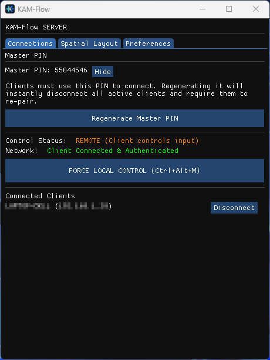
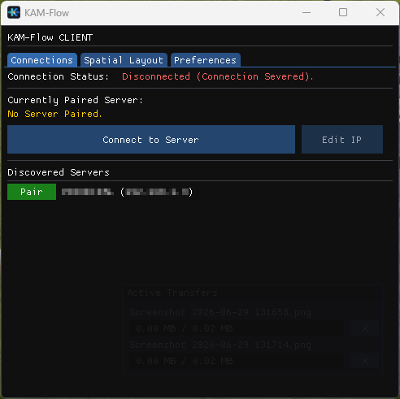
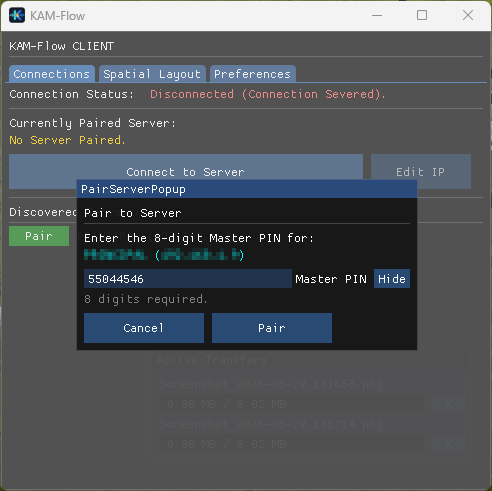
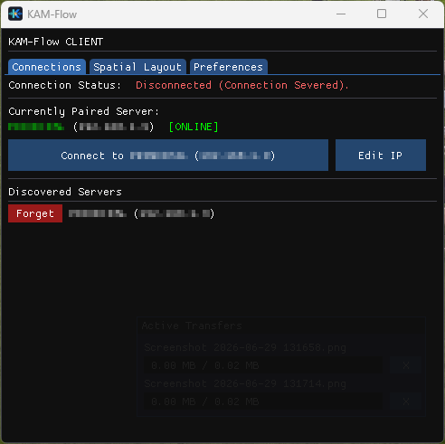

# KAM-Flow

KAM-Flow is a high-performance, low-latency Software KAM (Keyboard, Audio, Mouse) solution built to turn multiple Windows PCs into one unified workspace.

Tired of juggling multiple keyboards, mice, and headsets? KAM-Flow connects your Windows machines over your local network so you can control them all from a single keyboard and mouse — just move your cursor off the edge of one screen and onto the next. Audio from every machine plays through one headset, files transfer with a drag-and-drop, and your clipboard stays in sync across all of them.

It runs quietly in the background, stays out of your way, and makes multiple computers feel like one.

---

## Core Features

* **Cursor & Keyboard Sharing** — Move your mouse off the edge of your main monitor and it appears on your second PC. Type on any machine using the same keyboard. The input response is fast enough that you won't notice the network is involved.
* **Audio Mixing** — Hear system audio from every connected Client through the Server's headset. No manual routing or third-party mixer required.
* **Microphone Broadcast** — Stream your Server's microphone to Client PCs so apps like Discord or Zoom on those machines can use it. *(Requires a free Virtual Audio Cable on the Client — see the [Microphone Setup](#setting-up-microphone-broadcasting-vb-cable) section below.)*
* **File Transfers** — Drag a file onto the KAM-Flow window to send it to any connected machine. Transfers run on a separate channel so they don't interfere with your mouse or keyboard.
* **Clipboard Sync** — Copy text on one machine, paste it on another. Works in real-time.
* **Spatial Layout** — Arrange your screens in a visual grid that matches your physical desk. KAM-Flow uses this to know which edge of which screen leads where.

---

## Security

All network traffic — inputs, audio, clipboard data, and file transfers — is encrypted end-to-end. Here's how:

* **AES-GCM 256-bit Encryption** — Every packet is encrypted using hardware-accelerated Windows CNG (Cryptography Next Generation).
* **Secure PIN Storage** — The Master PIN is never written to a config file. It's hashed and stored in the Windows Credential Vault, which is protected by your Windows account login.
* **Tamper Detection** — Each packet carries an authenticated header (AAD) that detects any modification in transit.
* **Replay Protection** — Sequence counters prevent captured packets from being resent.
* **Size Limits** — Strict payload bounds protect against memory-based attacks.
* **Lock Screen Safety** — If a Windows UAC prompt or Lock Screen appears, KAM-Flow instantly returns mouse and keyboard control to the Server so you never get locked out.

---

## Getting Started

KAM-Flow is portable — no installer, no dependencies. Just download the `.exe` and run it.

### Requirements
* Windows 10 or later on all machines
* All machines must be on the same local network (Wi-Fi or Ethernet)
* Run as Administrator (required for low-level input hooks)

### Installation

1. Place `KAM-Flow.exe` in a dedicated folder on each machine (for example, `C:\KAM-Flow\` or your Desktop). Avoid restricted locations like `C:\Program Files\` — KAM-Flow creates a local settings file (`.ini`) next to the executable.
2. Right-click the file and select **Run as Administrator**. For convenience, create a Desktop shortcut and set it to always run as Administrator.
3. On the first launch, you'll see the **Pre-Flight Launcher**. Choose whether this machine is the **Server** (your main PC with the physical keyboard and mouse) or a **Client** (any secondary PC you want to control).

**Firewall note:** Windows may ask you to allow KAM-Flow through the firewall. Click **Allow** — this is needed for the machines to find and talk to each other on your local network.

---

## Using the Server (Main PC)

The Server is your primary machine. Its physical keyboard and mouse will control all connected Clients, and its headset will play audio from every Client.

### 1. Launch & Master PIN

After selecting **"START AS SERVER"**, KAM-Flow opens the **Connections** tab. At the top, you'll see the **Master PIN** section.

KAM-Flow automatically generates a secure, random 8-digit PIN the first time you start the Server. This PIN is what your Client machines will need in order to pair. You can:

* Click **Reveal** to see the PIN and share it with your Client devices.
* Click **Regenerate Master PIN** to create a new one. This will immediately disconnect any active Clients and require them to pair again with the new PIN.

### 2. Connections & Control

Below the Master PIN section, the **Connections** tab shows:

* **Control Status** — Whether the Server currently has local control or if a Client is being controlled remotely.
* **Connected Clients** — A list of all authenticated Clients with a **Disconnect** button next to each one.

When a Client is being controlled, a **FORCE LOCAL CONTROL** button appears. Clicking it (or pressing `Ctrl+Alt+M`) instantly snaps the mouse and keyboard back to the Server. This works even during full-screen games or when a Client becomes unresponsive.

### 3. Spatial Layout

Open the **Spatial Layout** tab and drag the Client boxes around the central Server box to match the physical arrangement of monitors on your desk. This tells KAM-Flow which screen edge leads to which machine.

For example: if your laptop sits to the left of your desktop, drag the Client box to the left of the Server box. Now, moving the cursor off the left edge of your desktop will make it appear on the laptop.

### 4. Preferences

The **Preferences** tab gives you control over how KAM-Flow behaves:

* **Startup & System** — Set a default start mode (Server), enable minimize-to-tray, or configure KAM-Flow to launch automatically with Windows for a hands-free setup.
* **Input & File Sync** — Toggle keyboard sharing, clipboard sync, and drag-and-drop file transfers.
* **Mouse Sensitivity** — Adjust the cursor speed on Client screens independently, without changing your Server's native DPI or gaming sensitivity.
* **Audio Mixing** — Enable the **Master Audio Mix** to hear Client audio through your headset. Adjust the **Jitter Buffer** if audio stutters on Wi-Fi, and enable **Mic Broadcast** to send your microphone to Clients.
* **Per-Client Controls** — Mute individual Clients, adjust their volume, or disable clipboard sync on the fly.
* **Corner Deadzones** — Protect the corners of your screen (0–10%) so you can reach the Start Menu or close maximized windows without accidentally transitioning to a Client.
* **Emergency Hotkey** — Customize the `Ctrl+Alt+M` key combination used to instantly reclaim local control.

---

## Using the Client (Secondary PC)

The Client is the machine being controlled. It receives mouse and keyboard input from the Server and can optionally stream its local audio back.

### 1. Pairing to a Server

After selecting **"START AS CLIENT"**, KAM-Flow opens the **Connections** tab. Everything you need to pair and connect is right here — there's no separate setup screen.

**If your Server is on the same network**, it will appear automatically under **Discovered Servers**. Next to each server, you'll see a green **Pair** button.

1. Click the **Pair** button next to the Server you want to connect to.
2. A popup will ask you to enter the Server's 8-digit **Master PIN**. Type it in (you can click **Show** to verify what you're typing) and click **Pair**.
3. The pairing is saved securely in your Windows Credential Vault. You won't need to enter the PIN again unless the Server regenerates it.

> **Already paired to a different Server?** KAM-Flow will warn you that only one Server can be paired at a time and ask if you'd like to switch. Clicking **Continue** will unpair the old Server and let you enter the new PIN.

### 2. Connecting

Once paired, the **Currently Paired Server** section at the top of the Connections tab shows your Server's name, IP address, and whether it's currently **[ONLINE]** or **[OFFLINE]**.

Click **Connect to [Server Name]** to establish the encrypted connection. That's it — move your mouse off the edge of the Server's screen and it will appear on the Client.

### 3. Editing the Server IP

If your Server's IP address changes (common on Wi-Fi networks with DHCP), you don't need to re-pair. Just click the **Edit IP** button next to the Connect button, update the IP address, and click **Save**. Your PIN stays the same.

### 4. Forgetting a Server

To unpair from the current Server, find it in the Discovered Servers list — it will have a red **Forget** button instead of Pair. Clicking **Forget** removes the saved PIN and lets you pair to a different Server.

### 5. Preferences

The Client's **Preferences** tab lets you configure local behavior:

* **Startup & System** — Auto-launch as Client, minimize to tray, and enable **Auto-Reconnect** so the connection recovers automatically after sleep or a Wi-Fi drop.
* **Input & File Sync** — Accept keyboard and clipboard data from the Server. Drag files onto the Client window to send them back. Incoming file transfers always show an Accept/Decline prompt to keep your disk safe.
* **Audio** — Choose whether to send this Client's audio to the Server. Enable **Receive Server Microphone** to hear the Server's mic through a Virtual Audio Cable (see below).
* **Corner Deadzones** — Protect the Client screen corners to prevent accidental cursor transitions back to the Server.
* **Emergency Hotkey** — Customize `Ctrl+Alt+M` to instantly disconnect from the Server at any time.

---

## Setting up Microphone Broadcasting (VB-CABLE)

Windows does not allow applications to create virtual microphone devices on their own. To use the Server's physical microphone in apps running on the Client (like Zoom, Discord, or OBS), you'll need a free Virtual Audio Cable installed on the Client PC.

**VB-CABLE** is a well-known, free audio driver. It's digitally signed by Microsoft (WHQL certified) and safe to install.

### 1. Download and Install (Client PC Only)

1. Go to [vb-audio.com/Cable/](https://vb-audio.com/Cable/) and download the **VB-CABLE Driver** for Windows.
2. Extract the ZIP file.
3. Right-click `VBCABLE_Setup_x64.exe` and select **Run as Administrator**.
4. Click **Install Driver** and reboot if prompted.

### 2. Fix Your Windows Sound Settings (Client PC Only)

Installing VB-CABLE sometimes changes your default audio devices. Check and correct them:

1. Open **Windows Sound Settings** (right-click the speaker icon in the taskbar).
2. Set your **Output device** back to your physical speakers or headphones (not "CABLE Input").
3. Set your **Input device** back to your physical microphone (not "CABLE Output").

### 3. Enable in KAM-Flow

1. On the **Server PC**: open Preferences and check **Broadcast Server Microphone to Clients**.
2. On the **Client PC**: open Preferences and check **Receive Server Microphone**.

KAM-Flow will automatically detect the Virtual Audio Cable and route the incoming microphone audio into it.

### 4. Configure Your Apps

1. On the **Client PC**, open the voice/audio settings of the app you want to use (Discord, Zoom, etc.).
2. Set the **Input Device / Microphone** to **CABLE Output (VB-Audio Virtual Cable)**.
3. Done — speak into the Server's physical microphone, and the Client app will hear it.

---

## Troubleshooting

| Problem | Solution |
|---------|----------|
| Server not appearing in Discovered Servers | Make sure both machines are on the same local network and that KAM-Flow is allowed through the Windows Firewall on both sides. |
| Client says "Authentication Failed" | The PIN may have changed. Verify the current Master PIN on the Server and re-pair. |
| Cursor feels laggy on the Client | Check if the Server PC is under heavy CPU load. KAM-Flow prioritizes input latency, but extreme system load can still affect it. Try connecting both machines via Ethernet instead of Wi-Fi. |
| Audio pops or clicks | Increase the **Jitter Buffer** slider in Preferences. The slider ranges from 20 ms to 200 ms (default is 80 ms). On Wi-Fi or under heavy CPU load, try values around 120–160 ms to give the audio stream more breathing room. |
| Mouse gets stuck after a Client crash | The Server automatically reclaims local control when a controlling Client disconnects. If it doesn't, press `Ctrl+Alt+M`. |
| Server IP changed and Client can't connect | Use the **Edit IP** button on the Client's Connections tab to update the IP address without re-pairing. |

---

## License

© Arnoldo Ibarra — Proprietary and Confidential. All rights reserved.
