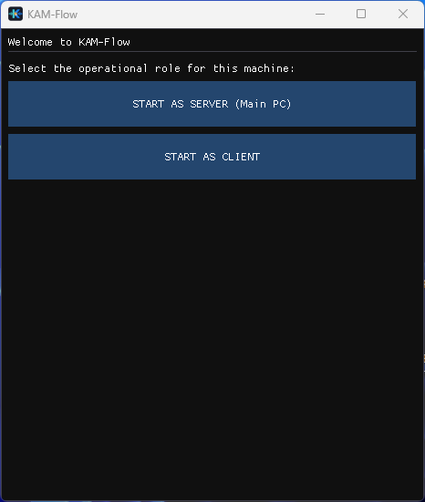
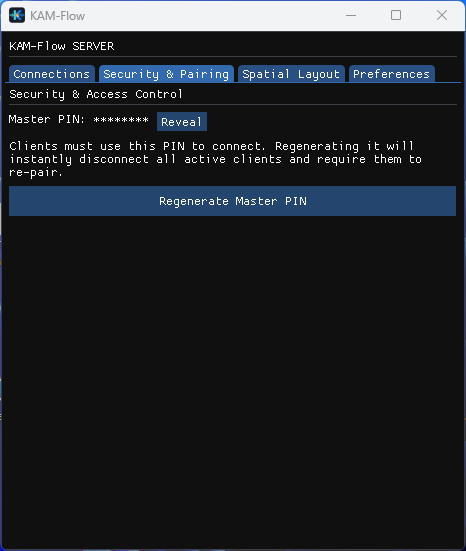
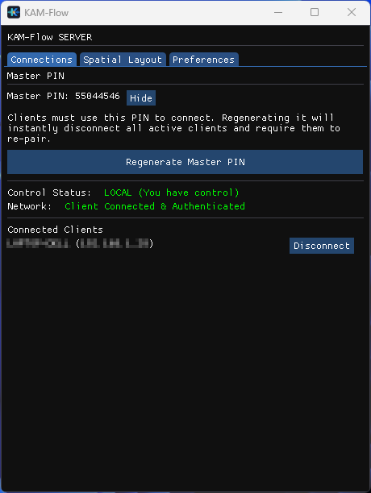
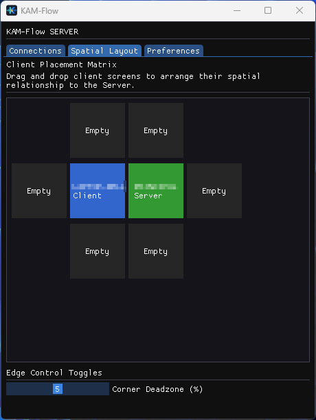
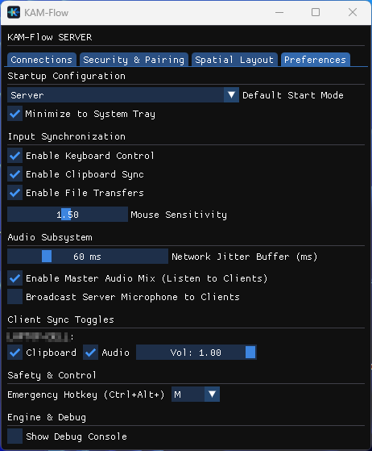
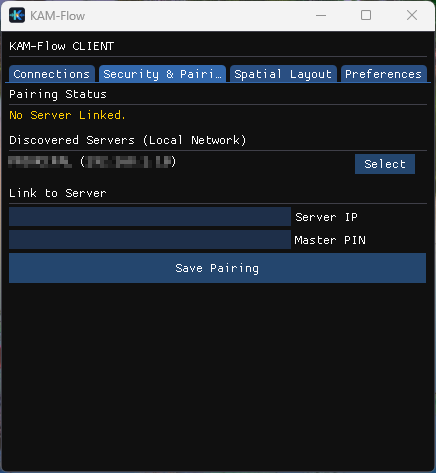
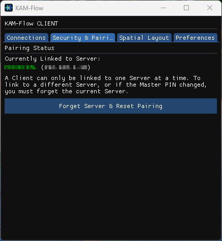
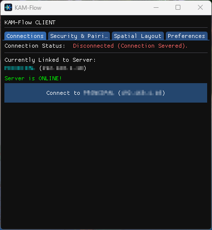
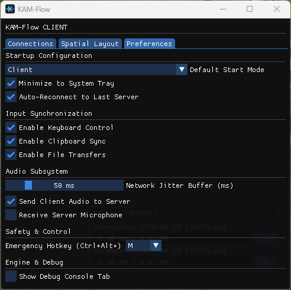

# KAM-Flow
KAM-Flow is a high-performance, low-latency Software KAM (Keyboard, Audio, Mouse) solution. It is designed to turn multiple physical machines into a single, unified workspace.

Tired of juggling multiple keyboards, mice, and headsets? KAM-Flow effortlessly unites your Windows PCs into one perfectly synchronized workspace.

Glide your cursor seamlessly across your desktop and laptop screens, type on any device using your main keyboard, hear audio from every computer through a single headset, and share files instantly with a simple drag-and-drop. Operating securely and silently in the background, KAM-Flow removes the clutter from your desk and the friction from your workflow, making multiple computers feel like one.

## Core Features
* **Zero-Latency KVM:** High-frequency, mathematically fractional cursor synchronization and keystroke injection ensures native-feeling control across all paired machines. Media streams and mouse deltas are transmitted over a dedicated high-speed UDP pipeline, with automatic fallback to reliable TCP if blocked by firewalls.
* **Centralized Audio Mixing:** Captures system audio from Client PCs using jitter-immune WASAPI loopback streams, mixing it seamlessly into the Server's playback device.
* **Microphone Broadcasting & Injection:** Stream the Server's primary microphone to any connected Client. *(Note: Injecting this received audio into Client applications like Discord or Zoom requires the installation of a free Virtual Audio Cable, such as VB-CABLE, on the Client PC).*
* **Out-Of-Band File Transfers:** Drag-and-drop files directly onto the UI to transfer them asynchronously over a dedicated, memory-safe TCP stream without interrupting KVM inputs.
* **Clipboard Synchronization:** Securely share copied text between machines in real-time.
* **Spatial Layout Matrix:** Visually arrange your physical monitors in a 2D grid to ensure cursor edge-transitions happen exactly where your screens meet.

---

## Security Architecture
KAM-Flow is built with an enterprise-grade, zero-trust security mindset:
* **AES-GCM 256-bit Cryptography:** All KVM, audio, clipboard, and file transfer payloads are encrypted using Windows Cryptography Next Generation (CNG). 
* **Zero-Permission Persistence:** Master PINs are never stored in plaintext configuration files. They are hashed via SHA-256 and securely saved exclusively in the Windows OS Credential Vault.
* **Authenticated Headers (AAD):** Prevents bit-flipping and packet manipulation.
* **Replay Attack Defense:** Monotonically increasing sequence counters ensure intercepted network packets cannot be replayed.
* **Memory Bounds Checking:** Strict payload limits actively defend against Out-Of-Memory (OOM) attacks.
* **UAC & Secure Desktop Failsafes:** Automatically handles User Account Control prompts and Windows Lock screens by immediately returning local control to the Server to prevent user lockouts.

---

## General Setup & Installation
KAM-Flow is a portable, standalone executable that does not require any installation or external dependencies (except for the optional microphone broadcasting feature, which requires a Virtual Audio Cable).

1. Place the `KAM-Flow.exe` file into a dedicated folder on both the machine you wish to use as the **Server** (the PC with the physical mouse and keyboard) and the machine(s) you wish to use as **Clients** (the secondary laptops/PCs). Because KAM-Flow generates a local `.ini` configuration file, it is highly recommended to place it in a user-accessible directory (like `C:\KAM-Flow\` or your Desktop) and avoid system-restricted folders like `C:\Program Files\` to prevent permission issues.
2. Right-click the executable and select **Run as Administrator**. *(For convenience, we recommend creating a Windows Desktop shortcut set to always "Run as Administrator").* On the first launch, it will display the **Pre-Flight Launcher**, which allows you to explicitly define whether this specific machine will act as the Server (sending inputs) or a Client (receiving inputs).
3. *Note: For KAM-Flow to communicate over the local network, you may need to allow it through the Windows Defender Firewall when prompted.*

---

## Using the Server (Main PC)
The Server is the "Master" machine. Its physical mouse and keyboard will control all connected Clients, and its headset will play the audio mixed from all Clients.

### 1. Initialization
* Select **"START AS SERVER"** on the Pre-Flight Launcher.
* Navigate to the **Security & Pairing** tab. KAM-Flow will have automatically generated a secure 8-digit **Master PIN** and saved it to your OS Credential Vault. You will need this PIN to link your Client devices.

### 2. Managing Connections
* The Server automatically broadcasts its presence over the local network via UDP beacons.
* In the **Connections** tab, you can view the connection status, see all actively authenticated clients, and forcefully disconnect them if necessary.
* Use the **FORCE LOCAL CONTROL** button (or press `Ctrl+Alt+M`) to instantly sever remote cursor locks and bring your mouse back to the Server screen. Because this hotkey operates at the lowest OS level, it will work instantly even if a full-screen game has locked your UI.

### 3. Spatial Layout
* Navigate to the **Spatial Layout** tab. 
* Drag and drop the connected Client boxes around the central Server box to match the physical layout of the monitors on your desk. This dictates which screen edges transition the cursor to which machines.

### 4. Options, Preferences & Quality of Life
The Server's **Preferences** tab provides powerful customization for your workspace:

* **Startup & System:** Set the "Default Start Mode" to automatically launch as a Server. Combine this with a Windows Startup shortcut and "Minimize to System Tray" for a seamless, hands-free experience.
* **Control & File Synchronization:** Toggle global keyboard and clipboard sharing. Drag-and-drop files directly onto the KAM-Flow window to transfer them to any selected Client(s) over a lag-free Out-Of-Band (OOB) stream.
* **Fractional Mouse Sensitivity:** Adjust the pointer speed on the Client screens independently without altering your Server's native gaming/desktop DPI settings.
* **Advanced Audio Routing:** Enable the **Master Audio Mix** to hear all connected Clients through your Server headset. You can tweak the **Network Jitter Buffer** to prevent audio stutter on unstable Wi-Fi, and enable **Server Mic Broadcast** to stream your main microphone to Clients.
* **Individual Client Overrides:** Dynamically mute audio, adjust volume, or disable clipboard sync for specific clients on the fly.
* **Corner Deadzones (Spatial Tab):** Protect the physical corners of your screens (0-10%). This prevents accidental transitions to a Client PC when aiming for the Start Menu or closing maximized windows.
* **Emergency Hotkey:** Customize the `Ctrl+Alt+M` combination that invokes a low-level OS failsafe to instantly snap the cursor back to the Server.

---

## Using the Client (Secondary PC)
The Client is the machine being controlled. It receives inputs from the Server and can optionally stream its local audio back to the Server.

### 1. Initialization & Pairing
* Select **"START AS CLIENT"** on the Pre-Flight Launcher.
* Navigate to the **Security & Pairing** tab.
* Under "Discovered Servers (Local Network)", you should see your Server PC listed. Click **Select**. *(If your network blocks UDP broadcasts, you can manually type the Server's local IP address into the box).*
* Enter the 8-digit **Master PIN** generated by the Server and click **Save Pairing**.

### 2. Connecting
* Once paired, navigate to the **Connections** tab.
* Click **Connect to [Server Name]**. 
* The Client is now securely tethered. You can move your mouse off the edge of your Server's monitor to take control of the Client PC.

### 3. Options, Preferences & Quality of Life
The Client's **Preferences** tab allows you to configure its local behavior, audio routing, and safety settings:

* **Startup & System:** Automatically launch as a Client on boot, minimize to the system tray, and enable **Auto-Reconnect** to seamlessly recover the connection if your laptop goes to sleep or drops Wi-Fi.
* **Input & File Synchronization:** Accept keyboard and clipboard data from the Server. You can also drag-and-drop files onto the Client UI to send them securely back to the Server. Incoming files trigger a safe Accept/Decline pop-up to protect your disk.
* **Corner Deadzones (Spatial Tab):** Protect the corners of the Client screen (0-10%) to prevent accidental cursor transitions back to the Server when interacting with maximized windows.
* **Local Audio Routing:** Choose whether to **Send Client Audio** to the Server for mixing. Adjust the **Network Jitter Buffer** to ensure smooth playback when you enable **Receive Server Microphone** (requires VB-CABLE).
* **Emergency Hotkey:** Customize the `Ctrl+Alt+M` hotkey to safely sever the encrypted connection and disconnect from the Server at any time.

---

## Setting up Microphone Broadcasting (VB-CABLE)
Due to strict Windows security architecture, applications cannot programmatically create "fake" hardware microphones. To use the Server's microphone in your local Client applications (like Zoom, Discord, or OBS), a safe, free Virtual Audio Cable is required to act as a bridge on the Client PC.

VB-CABLE is 100% legal, zero-latency, digitally signed by Microsoft WHQL, and poses zero kernel-level security risks.

### 1. Download and Install (Client PC Only)
1. Visit [vb-audio.com/Cable/](https://vb-audio.com/Cable/) and download the **VB-CABLE Driver** for Windows.
2. Extract the downloaded ZIP file to a folder.
3. Right-click `VBCABLE_Setup_x64.exe` and select **Run as Administrator**.
4. Click **Install Driver** and reboot your PC if prompted.

### 2. Windows Sound Configuration (Client PC Only)
*Installing VB-CABLE often changes your default Windows sound devices automatically. You must change them back!*
1. Open Windows Sound Settings.
2. Ensure your **Default Output (Playback)** is set back to your physical Speakers/Headphones, *not* CABLE Input.
3. Ensure your **Default Input (Recording)** is set back to your actual physical Microphone, *not* CABLE Output.

### 3. Route Audio in KAM-Flow
1. On your **Server PC**, go to Preferences and check **Broadcast Server Microphone to Clients**.
2. On your **Client PC**, go to Preferences and check **Receive Server Microphone**. 
*KAM-Flow will automatically detect the Virtual Cable and route the incoming Server microphone audio directly into "CABLE Input".*

### 4. Configure Your Apps (Discord, Zoom, etc.)
1. On the **Client PC**, open the voice settings of the app you want to use.
2. Change the **Input Device / Microphone** to **CABLE Output (VB-Audio Virtual Cable)**.
3. You can now speak into your Server's physical microphone, and the app on your Client PC will hear it perfectly!
